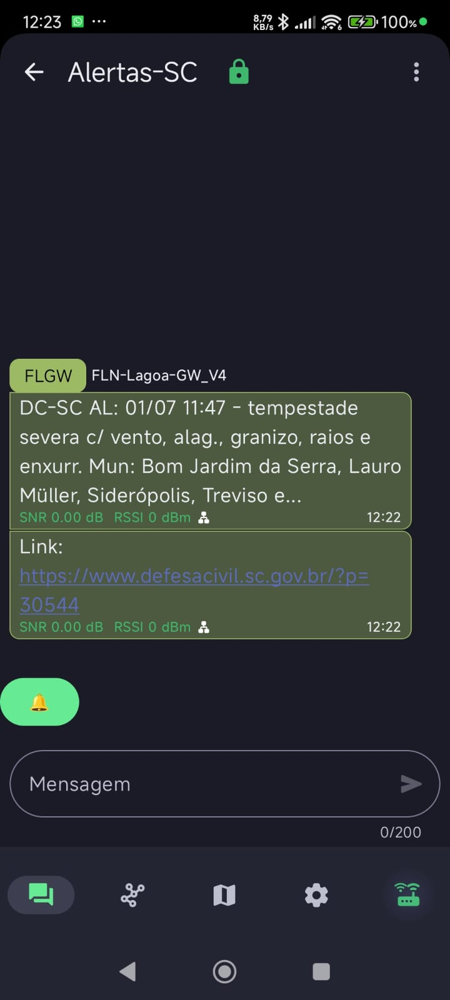
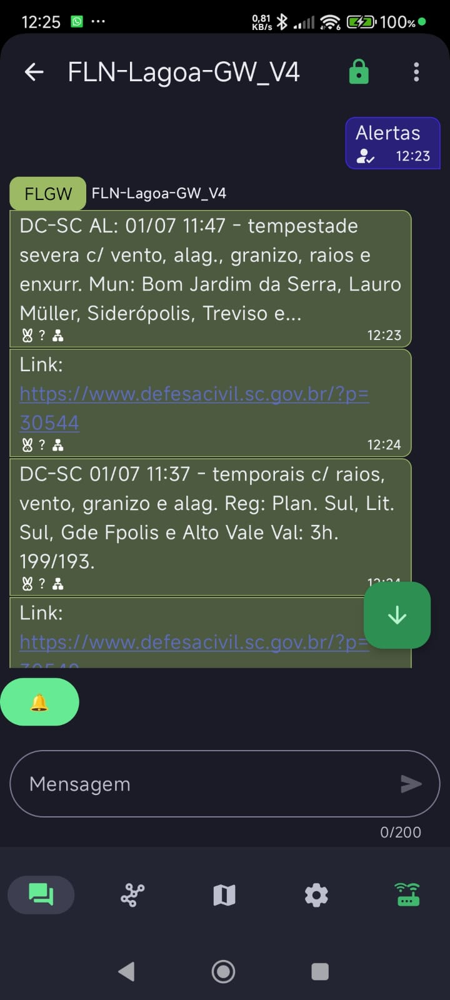

# Defesa Civil SC → Meshtastic

Integração para ler alertas publicados pela Defesa Civil de Santa Catarina e redistribuir mensagens resumidas para uma malha Meshtastic.

A primeira versão usa **Home Assistant + AppDaemon + integração Meshtastic**. A estrutura do repositório já separa essa integração de futuras versões standalone sem Home Assistant.

> Este projeto não é oficial da Defesa Civil. Use como integração comunitária e mantenha sempre os canais oficiais de alerta como referência primária.

## Funcionalidades atuais

- Lê o feed RSS da categoria de alertas da Defesa Civil SC.
- Respeita os campos RSS `sy:updatePeriod` e `sy:updateFrequency` para definir o intervalo de leitura.
- Armazena os últimos 10 alertas.
- Evita reenvio de alertas repetidos usando `guid`.
- Envia cada novo alerta para canal Meshtastic via `notify.mesh_channel_*` do Home Assistant.
- Envia o alerta em duas mensagens:
  - resumo compactado;
  - link do alerta.
- Responde mensagens diretas com texto `ALERTAS`, retornando os 3 últimos alertas armazenados.
- Tem modo de teste para validar o envio sem depender de novos alertas reais.
- Compacta prefixos longos:
  - `ALERTA` → `AL:`
  - `ATENÇÃO` → `AT:`
  - `OBSERVAÇÃO` → `OBS:`

## Fonte de dados

Feed RSS usado pela integração:

```text
https://www.defesacivil.sc.gov.br/categoria/alerta/feed/
```

Campos principais utilizados:

- `item/title`
- `item/content:encoded`
- `item/guid`
- `channel/sy:updatePeriod`
- `channel/sy:updateFrequency`

## Estrutura do projeto

```text
defesa-civil-sc-meshtastic/
├── README.md
├── LICENSE
├── SECURITY.md
├── CONTRIBUTING.md
├── .gitignore
├── core/                                    # Módulos compartilhados (refatoração)
│   ├── __init__.py
│   ├── constants.py                        # Constantes centralizadas
│   ├── models.py                           # Alert, State dataclasses
│   ├── rss_parser.py                       # Parser RSS
│   └── message_formatter.py                # Formatador de mensagens
├── integrations/
│   ├── home-assistant-appdaemon/
│   │   ├── README.md
│   │   ├── apps/
│   │   │   └── defesa_civil_sc_alertas.py
│   │   └── config/
│   │       ├── appdaemon.yaml.example
│   │       └── apps.yaml.example
│   └── standalone-meshtastic/
│       ├── README.md
│       ├── main.py
│       ├── requirements.txt
│       ├── config.example.yaml
│       ├── state.example.json
│       ├── .gitignore
│       └── src/
│           ├── __init__.py
│           ├── config_manager.py
│           ├── state_manager.py
│           └── meshtastic_connector.py
├── examples/
│   └── defesa_civil_sc_alertas_state.example.json
├── docs/
│   ├── PROJECT_STRUCTURE.md
│   └── ARCHITECTURE.md                     # Documentação de arquitetura (novo)
└── tests/                                  # Suite de testes centralizados
    ├── __init__.py
    ├── conftest.py
    ├── README.md
    ├── test_constants.py
    ├── test_models.py
    ├── test_rss_parser.py
    ├── test_message_formatter.py
    └── fixtures/
        └── sample_feed.xml
```

## Integrações disponíveis

- [Home Assistant com AppDaemon](integrations/home-assistant-appdaemon/README.md)
- [Standalone Meshtastic (Python)](integrations/standalone-meshtastic/README.md)

## Arquitetura e Módulos Compartilhados

A partir da versão refatorada, o projeto usa módulos centralizados em `core/` para evitar duplicação de código entre integrações:

### core/

- **constants.py**: Constantes centralizadas (URLs, limites, intervalos, mapeamentos)
- **models.py**: Dataclasses para type-safety (`Alert`, `State`)
- **rss_parser.py**: Parser RSS da Defesa Civil SC
- **message_formatter.py**: Formatação e compactação de mensagens para LoRa

Veja [docs/ARCHITECTURE.md](docs/ARCHITECTURE.md) para detalhes sobre o design e padrões.

### Testes

Suite de testes centralizados usando pytest em `tests/`:

```bash
pip install pytest
pytest tests/ -v
```

Executa 40+ testes cobrindo:
- Parsing RSS e extração de intervalos
- Formatação e compactação de mensagens
- Serialização de modelos
- Tratamento de erros e edge cases

Veja [tests/README.md](tests/README.md) para mais detalhes.

## Integrações em desenvolvimento

Futuras integrações sugeridas:


## Formato das mensagens

Exemplo de mensagem compactada:

```text
DC-SC AL: 01/07 11:47 - tempestade severa c/ vento, alag., granizo, raios e enxurr. Mun: Bom Jardim da Serra... Val: 1h. 199/193.
```

Segunda mensagem:

```text
Link: https://www.defesacivil.sc.gov.br/?p=XXXXX
```



## Canal de alertas de SC


## Mensagens diretas

Se outro node Meshtastic enviar mensagem direta ao gateway com:

```text
ALERTAS
```

O app responde com os 3 últimos alertas armazenados, cada um no mesmo formato de duas mensagens.



## Arquivos que não devem ir para o GitHub

Não publique arquivos reais de estado ou configuração local com dados da sua malha:

```text
/config/apps/defesa_civil_sc_alertas_state.json
/config/apps/apps.yaml
/config/appdaemon.yaml
```

O `.gitignore` deste projeto já ignora esses arquivos quando usados dentro do repositório.

## Próximas versões sugeridas

### Standalone sem Home Assistant

Pasta sugerida:

```text
integrations/standalone-meshtastic/
```

Possíveis transportes:

- Python + `meshtastic` via serial/USB;
- Python + Meshtastic TCP;
- MQTT do Meshtastic;
- serviço Linux com `systemd`;
- container Docker.

### Filtros futuros

- Filtrar por município.
- Filtrar por região da Defesa Civil SC.
- Filtrar por severidade: `AL:`, `AT:`, `OBS:`.
- Enviar somente alertas que mencionem regiões configuradas.
- Usar CAP/Common Alerting Protocol quando houver fonte pública estruturada.

## Aviso operacional

Meshtastic usa rádio LoRa e tem capacidade limitada de payload e airtime. Evite flood:

- mantenha mensagens curtas;
- evite reenviar histórico completo na inicialização;
- use canais privados/comunitários;
- respeite boas práticas de uso da malha local.

## Licença

MIT. Veja `LICENSE`.
